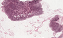
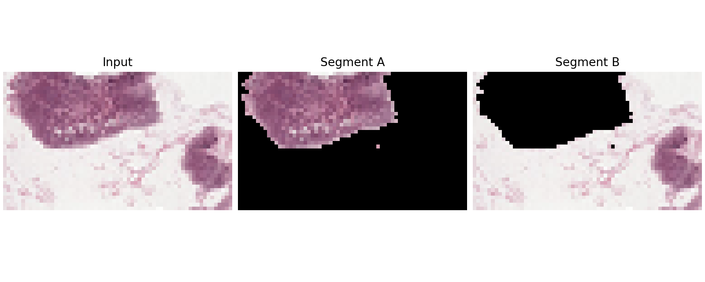

# Spectral Image Segmentation

Graph-based image segmentation using a normalized cut / spectral clustering approach.

## Example Result

| Input | Segmentation Result | Binary Mask |
|---|---|---|
|  |  |  |

## Setup

```bash
pip install numpy scipy matplotlib imageio opencv-python
```

## Run
```
python image_segmentation.py sample.png \
  --output tissue_segmentation_result.png \
  --mask-output tissue_segmentation_mask.png \
  --radius 6 \
  --sigma-b 0.03 \
  --sigma-x 5
```

## What it does
Builds a pixel graph from local image neighborhoods
Computes edge weights using brightness and spatial distance
Applies spectral graph partitioning to separate image regions
Outputs both a visual segmentation result and a binary mask

## Notes
This is a classical graph-based segmentation demo, not a production medical segmentation model.
